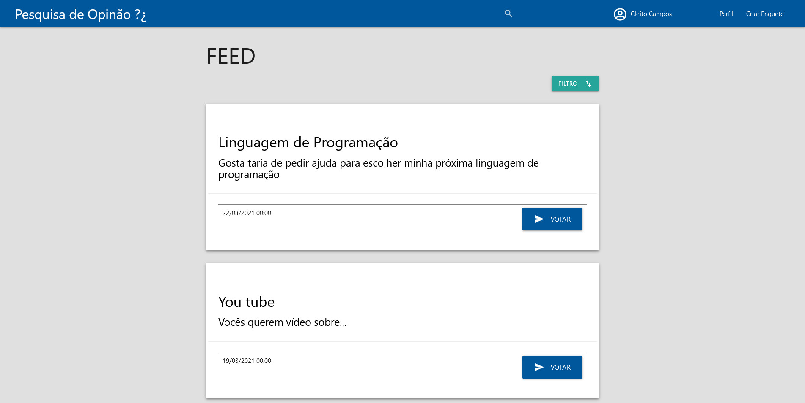
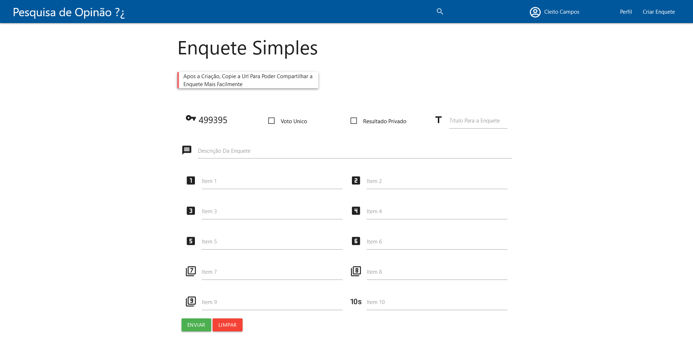
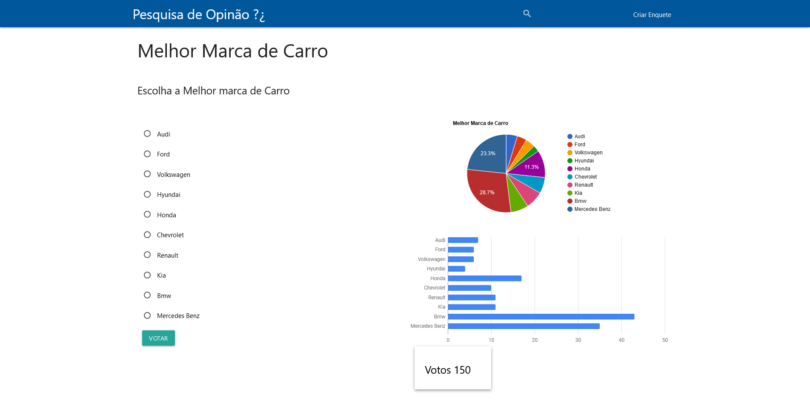
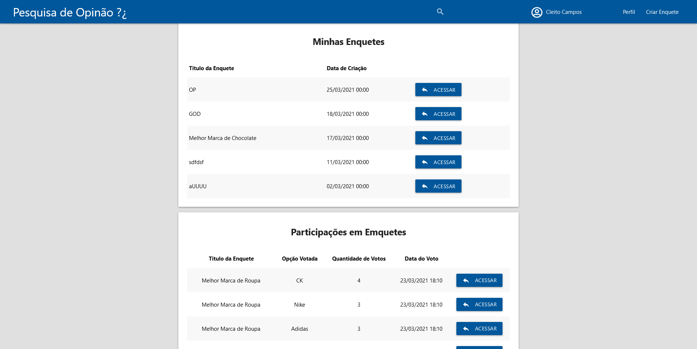

<h1 align="center">Pesquisa De Opinião</h1>

  

 

</img>
</img> 
</img>
</img> 

## 💻 Projeto

O <b>Pesquisa De Opinião</b> e um website para criação de enquete, foi desenvolvido para um trabalho de faculdade. Com o propósito de fornecer ferramentas para auxiliar na coleta e no armazenamento das informações geradas pelas enquetes, e para a visualização destas informações, são gerados gráficos representativos das informações armazenadas. 

## ✨ Tecnologias

Esse projeto foi desenvolvido com as seguintes tecnologias:

- [PHP](https://www.php.net/)
- [MySQL](https://www.mysql.com/)
- [Materialize](https://materializecss.com/)

## 🚀 Como executar

- Clone o repositório 

- Crie o banco de dados, o arquivo [pesquisa_de_opniao](pesquisa_de_opniao.sql) contém o banco de dados, caso esteja utilizando o [phpMyAdmin](https://www.phpmyadmin.net/) basta importa este arquivo para dentro dele, de acordo com a [documentação](https://docs.phpmyadmin.net/pt_BR/latest/import_export.html). 
Caso não esteja, abra o arquivo e copie o nome do banco das tabelas e os dados se preferir para o [MySQL Workbench](https://www.mysql.com/products/workbench/) e execute. 

- Por fim, certifique que as configurações de [conexaoBD](conexaoBD.php) estão de acordo com seu ambiente local 

## 📄 Licença

Esse projeto está sob a licença MIT. Veja o arquivo [LICENSE](LICENSE) para mais detalhes.